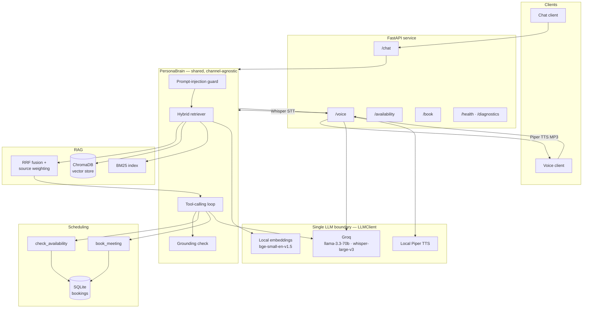
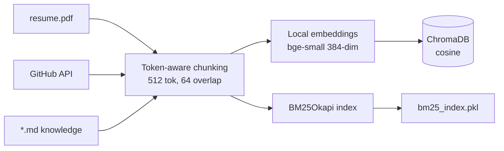
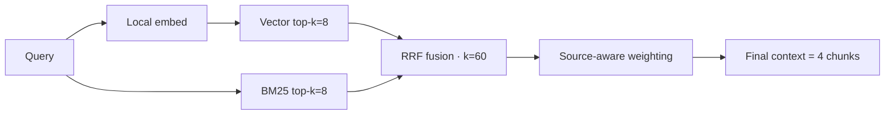
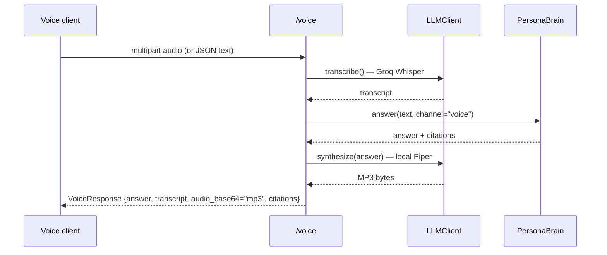

# AI Persona Agent — Architecture

**Author:** Sarthak Midha · **Submission:** Scaler AI Engineer Assignment

A digital persona that answers questions about a candidate's background and schedules
meetings, grounded strictly on a verified corpus (resume, GitHub, hand-authored knowledge
files). One shared "brain" serves both a **chat** and a **voice** channel. The system runs
on a **fully free stack** — Groq for generation, local models for embeddings and speech —
with no paid API dependency.

---

## 1. Problem statement

Traditional resumes are static: a recruiter cannot interrogate them, and generic chatbots
hallucinate when asked about a specific person. The goal of this project is an AI system that:

1. **Answers accurately and grounded** — every factual claim is traceable to a source
   document; the system says "I don't have that information" rather than inventing facts.
2. **Supports natural conversation** across both **text** and **voice**.
3. **Automates interview scheduling** through tool calling (availability + booking).
4. **Runs at zero cost** — suitable for a student submission with no billing.

The core engineering challenge is **grounded retrieval-augmented generation (RAG)** over a
small, heterogeneous personal corpus, plus a **tool-calling agent** for scheduling, exposed
through a clean API and a voice pipeline — all while surviving free-tier rate limits.

---

## 2. High-level architecture



**Design principle — one shared brain.** Both channels call the *identical*
`PersonaBrain.answer()`; the voice route is a thin Speech-to-Text / Text-to-Speech wrapper
around it. This guarantees chat and voice give consistent answers and keeps the surface area
small.

**Design principle — one network boundary.** Every model call funnels through a single
class, `app/brain/llm.py::LLMClient`, exposing four primitives: `chat`, `embed`,
`transcribe`, `synthesize`. Swapping providers (the OpenAI→Groq migration) touched essentially
this one file.

---

## 3. Component map

| Layer | Module | Responsibility |
|---|---|---|
| Config | `app/config.py` | All tunables via `pydantic-settings` (`.env`). Nothing hard-coded elsewhere. |
| LLM boundary | `app/brain/llm.py` | Groq chat/STT + local embeddings + local TTS; tenacity retries |
| Brain | `app/brain/persona.py` | Guard → retrieve → tool loop → grounding → citations → persist |
| Prompts | `app/brain/prompts.py` | Persona system prompt, context block, citation rendering |
| Retrieval | `app/rag/` | `vector_store`, `bm25_index`, `hybrid` (RRF), `retriever`, `reranker`, `embeddings`, `chunking` |
| Ingestion | `app/ingestion/` | `resume`, `github_source`, `markdown_source`, `pipeline`, `run_ingest` |
| Scheduling | `app/scheduling/calendar.py`, `app/tools/` | Availability math + booking persistence as LLM tools |
| Security | `app/security/` | `prompt_guard` (injection), `grounding` (citation/lexical verification) |
| API | `app/api/routes/` | `chat`, `voice`, `availability`, `booking`, `health` (+`/diagnostics`) |
| Persistence | `app/db/` | SQLAlchemy models: conversations, messages, bookings, query logs, eval results |
| Evaluation | `eval/` | Gold dataset, retrieval/grounding/booking metrics, runner |

---

## 4. Data ingestion pipeline

`app/ingestion/pipeline.py` orchestrates: **load documents → chunk → embed → upsert to
Chroma → (re)build BM25**. Entry point: `python -m app.ingestion.run_ingest --reset`.



**Chunking** (`app/rag/chunking.py`): token-aware via `tiktoken` (`cl100k_base`),
`chunk_size_tokens=512`, `chunk_overlap_tokens=64`. Each chunk carries
`source_type`, `title`, and metadata (`filename`/`path`) so retrieval and citations can
attribute it.

### 4.1 Resume ingestion (`app/ingestion/resume.py`)
Parses `data/resume/resume.pdf` with `pypdf`, extracts text, and chunks it. Tagged
`source_type="resume"`. Captures contact details, professional summary, and per-project
bullet points (ATW, SurveySurf, etc.).

### 4.2 GitHub ingestion (`app/ingestion/github_source.py`)
Pulls, via the GitHub REST API (token optional, raises rate limits):
- **Repository metadata** (`github_repo`) — name, language, stars, last-pushed.
- **READMEs** (`github_readme`).
- **Commit history** (`github_commit`) — up to `github_max_commits_per_repo=25`/repo.
- **Source files** (`github_source`) — up to `github_max_source_files_per_repo=6`/repo,
  `github_max_file_bytes=60_000`, filtered by extension.

Bounded by `github_max_repos=8`. This is the **largest** contributor to the corpus
(see §11 — a key tradeoff).

### 4.3 Markdown knowledge ingestion (`app/ingestion/markdown_source.py`)
Recursively ingests hand-authored `*.md` under `data/` — `about.md`, `experience.md`,
`projects.md`, `portfolio.md` — the **authoritative persona narrative**. Tagged
`source_type="markdown"` with the filename in metadata. These curated files are the highest-value
source for personal/professional questions.

---

## 5. Vector store — ChromaDB (`app/rag/vector_store.py`)

- `chromadb.PersistentClient` at `./data/chroma`, single collection `persona_corpus`.
- **Cosine** space (`hnsw:space: cosine`); higher similarity = better (`score = 1 - distance`).
- `embedding_function=None` — **we supply all vectors ourselves** so Chroma never calls out
  to a model. Embeddings are produced locally and passed in.
- Anonymized telemetry disabled (env switch + client setting + logger silencing) to remove a
  noisy `posthog` incompatibility on startup.

## 6. Lexical index — BM25 (`app/rag/bm25_index.py`)

- `BM25Okapi` from `rank-bm25` over the same chunk set, persisted to
  `data/bm25/bm25_index.pkl`. Rebuilt from the vector store's stored chunks at startup if the
  file is missing, keeping lexical and dense indexes consistent.

## 7. Hybrid retrieval (`app/rag/retriever.py`, `app/rag/hybrid.py`)



1. **Dense** — embed query locally, search Chroma for `top_k_vector=8`.
2. **Sparse** — BM25 for `top_k_bm25=8`.
3. **Reciprocal Rank Fusion** — `score(c) = w(source) · Σ 1/(k + rank_i)`, `rrf_k=60`,
   deduped by chunk id.
4. **Source-aware weighting** (the relevance fix, §11) — multiply each fused score by a
   per-`source_type` weight: curated narrative (`resume`, `markdown`) **×2.5**, raw
   `github_source` **×0.4**, everything else ×1.0. Pure score reweighting — rank maths
   unchanged.
5. **Reranker** — pluggable (`none` | `llm` | `cohere`). Default **`none`** (`NoOpReranker`)
   for zero token cost; RRF + weighting alone achieve full benchmark coverage.
6. Truncate to `final_context_chunks=4`.

Every stage is timed and degrades gracefully: a failure in either retriever falls back to the
other rather than aborting the answer.

---

## 8. Scheduling tools (`app/scheduling/`, `app/tools/`)

Exposed to the model as OpenAI-style function tools and dispatched inside the brain's
tool-calling loop:

- **`check_availability(date_from, date_to, duration_minutes)`** → free slots.
- **`book_meeting(name, email, start_time, duration_minutes, topic)`** → confirmed booking or
  alternatives.

`app/scheduling/calendar.py` validates each request in UTC: not in the past, on a configured
working day, within working hours, and free of conflicts/overrides. Bookings persist to SQLite.
Defaults: `Asia/Kolkata`, working days Mon–Sat, hours 10:00–22:00, 30-minute slots, 14-day
horizon. The same `/availability` and `/book` REST endpoints exist for direct API use and are
fully deterministic (no LLM involved), which makes them trivially testable.

The brain runs the loop up to `max_tool_iterations=4`, appending tool results and re-prompting
until the model produces a natural-language answer; grounding is skipped for pure
tool-confirmation answers.

---

## 9. Groq migration (free stack)

The system originally targeted OpenAI but was migrated to a **zero-cost** stack. Because all
model calls go through `LLMClient`, the migration was localized:

| Capability | Before (OpenAI) | After (free stack) |
|---|---|---|
| Chat + tool calling | gpt-4o-mini | **Groq** `llama-3.3-70b-versatile` (OpenAI-compatible API, reused SDK + `base_url`) |
| Embeddings | text-embedding-3-small (1536-d) | **local** `BAAI/bge-small-en-v1.5` (384-d, normalized) |
| Speech-to-text | whisper-1 | **Groq** `whisper-large-v3` |
| Text-to-speech | tts-1 | **local Piper** `en_US-lessac-medium` → MP3 via `lameenc` |

Key consequences:
- **Embeddings are local and free** → ingestion has no API cost or quota.
- **Dimension change (1536→384)** required a full corpus re-ingest (`--reset`).
- Groq is OpenAI-API-compatible, so the existing `tenacity` retry policy and error types carry
  over unchanged.
- **Rate-limit resilience**: a Groq 429 is detected explicitly and returned as a clear
  "AI service is temporarily rate-limited" message **with citations still attached**, rather
  than a generic failure.

**Free-tier token budget** is kept low by design: reranker `none`, **rule-based grounding**
(zero LLM calls), and small retrieval windows → roughly **~2.5K tokens per turn** vs ~12.5K
before tuning.

---

## 10. Voice architecture (`app/api/routes/voice.py`)



- **STT**: Groq `whisper-large-v3` (separate audio quota from chat tokens).
- **Brain**: the *same* `PersonaBrain` on the `"voice"` channel (terser, spoken-style prompt).
- **TTS**: Piper synthesizes 16-bit PCM **offline**; encoded to MP3 with `lameenc` so the
  response contract (`audio_format="mp3"`, base64) is unchanged.
- **Graceful degradation**: if TTS fails, the route still returns the text answer.

---

## 11. Challenges faced

1. **Python 3.13 / removed `cgi` module** — an older `httpx` pulled the deleted stdlib `cgi`
   battery; resolved by aligning dependency versions for 3.13.
2. **OpenAI billing wall** — the original stack required paid credits; motivated the full
   migration to Groq + local models.
3. **Free-tier rate limits** — Groq enforces per-minute (TPM) and per-day (TPD) token caps,
   per model. A token-heavy pipeline (LLM reranker + LLM grounding + large context) exhausted
   the daily budget. Fixed by cutting per-turn tokens ~80% (reranker off, rule-based grounding,
   smaller retrieval) and adding explicit 429 handling.
4. **Small-model tool-calling regression** — `llama-3.1-8b-instant` (chosen for its larger
   free budget) *under-answers* knowledge questions when tool schemas are attached: it returned
   "I don't have that information" even with the answer in context. Isolated by testing
   with/without tools and across models; fixed by using `llama-3.3-70b-versatile` for the
   tool-calling loop.
5. **Corpus imbalance (the big one)** — **92% of the 116-chunk corpus is GitHub content**
   (61% raw source code alone); only **8% is the curated persona narrative**. Rank-based RRF is
   source-agnostic, so GitHub code chunks flooded the top-k and buried resume/markdown answers.
   A 25-question retrieval benchmark scored only 20/25. Fixed with **source-aware fusion
   weighting** → **25/25** (see `evaluation_report.md`).

---

## 12. Tradeoffs

| Decision | Benefit | Cost |
|---|---|---|
| Local embeddings (bge-small) | Free, offline, no quota | Lower retrieval quality than large hosted models; one-time model download |
| Reranker `none` (RRF only) | Zero tokens per query | Less precise ranking; mitigated by source weighting |
| Rule-based grounding | Zero LLM calls, deterministic | Heuristic (citation + lexical) vs an LLM judge |
| `70b` chat model | Reliable tool calling + answers | Tighter free-tier limits than `8b` (mitigated by token cuts + 429 fallback) |
| Small retrieval window (4 final) | Few tokens per turn | Lower recall; offset by source weighting |
| Source-aware weighting (heuristic) | Fixes coverage with no re-ingest | Tuned constants, not learned; corpus-specific |
| Local Piper TTS | Free, offline voice | Larger install; one voice model |

---

## 13. Future improvements

- **Rebalance the corpus at ingest** — cap `github_max_source_files_per_repo` to 1 (or drop
  raw source entirely), so curated narrative isn't outnumbered 10:1. This is the principled
  version of the source-weighting heuristic and would also shrink the index.
- **Re-enable the LLM reranker on 70b** for harder, ambiguous queries (e.g. name collisions
  like "Vibora" the company vs the GitHub repo), gated to stay within token budget.
- **Asymmetric / instruction-tuned embeddings** or a larger local model for better dense recall.
- **Streaming responses** for chat and lower-latency voice.
- **Learned source weights / a small cross-encoder** to replace the hand-tuned multipliers.
- **Caching** of query embeddings and frequent answers to further reduce Groq calls.

---

## 14. Running the system

```bash
python -m venv .venv && .venv/bin/python -m pip install -r requirements.txt
cp .env.example .env            # set GROQ_API_KEY (free: console.groq.com/keys)
# place Piper voice under data/piper/ (see README)
.venv/bin/python -m app.ingestion.run_ingest --reset   # build the corpus
.venv/bin/python -m uvicorn app.main:app --port 8000    # serve
```

Verify with `GET /diagnostics` (reports models, backends, corpus size) and `GET /health`.
