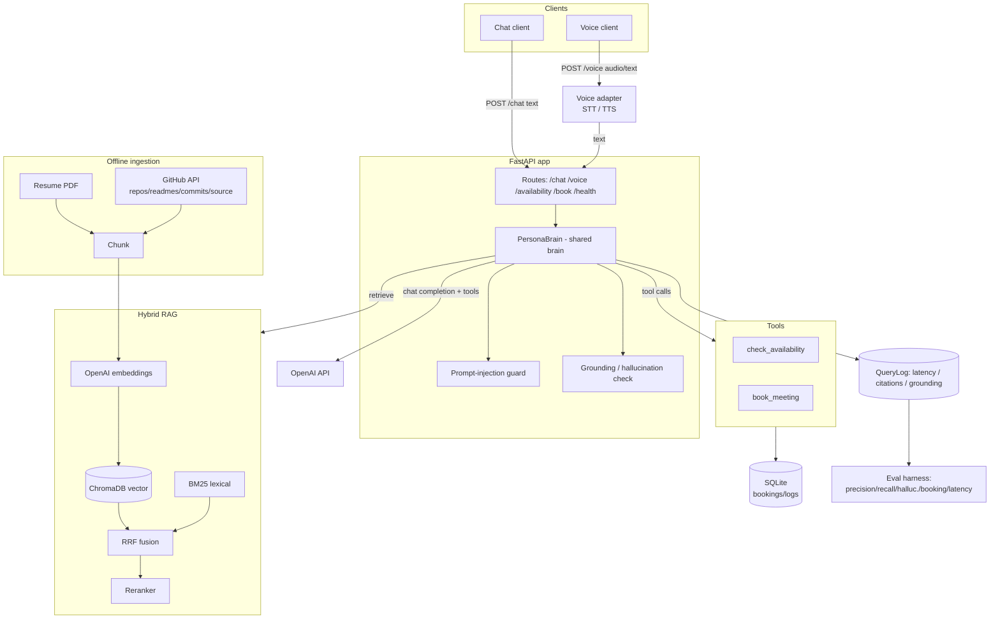
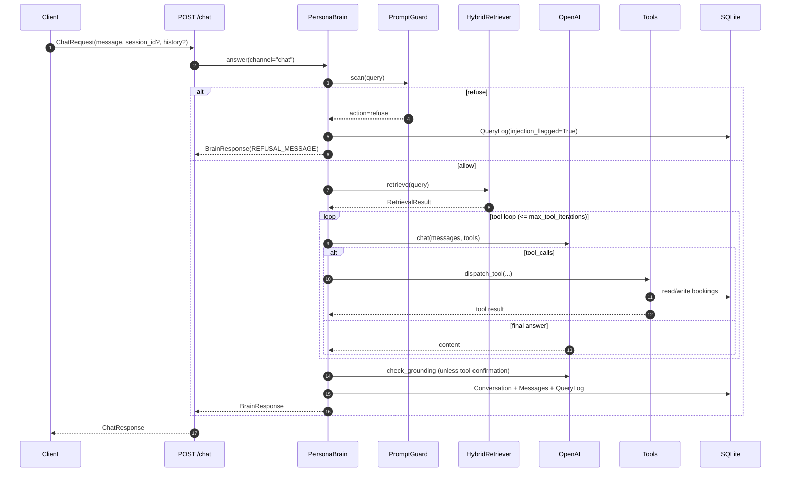
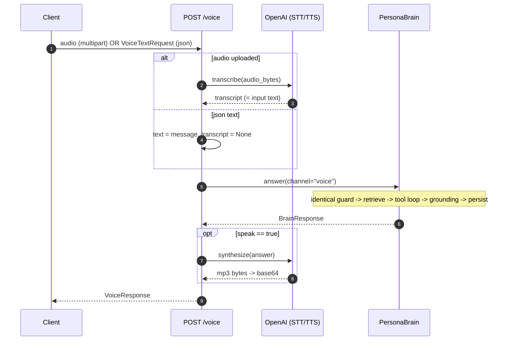
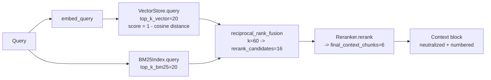

# Architecture — AI Persona System ("the brain")

This document is the deeper companion to the [README](../README.md). It breaks down the components,
walks the chat and voice request lifecycles step by step, details the RAG pipeline, documents the
database schema, and describes the evaluation methodology. The authoritative contract for every
name, signature, and data model is [`BUILD_SPEC.md`](BUILD_SPEC.md).

---

## System diagram



The standalone source for this diagram is [`architecture.mmd`](architecture.mmd).

---

## Component breakdown

### Configuration — `app/config.py`

A single `pydantic_settings.BaseSettings` subclass (`Settings`) holds every tunable: OpenAI models
and timeouts, reranker provider, GitHub ingestion limits, RAG parameters (chunk size/overlap,
`top_k_vector`, `top_k_bm25`, `rrf_k`, `rerank_candidates`, `final_context_chunks`), persona
identity, scheduling rules (timezone, working days/hours, slot length, horizon), the database URL,
security toggles, brain behaviour (`chat_temperature`, `max_tool_iterations`, `max_history_messages`),
and server options. `get_settings()` returns an `lru_cache`d instance so config is read once. It is
intentionally a leaf module — it imports nothing from upper layers — to keep the dependency graph
acyclic.

### Logging — `app/logging_config.py`

`setup_logging(level)` configures the root logger with the format
`%(asctime)s %(levelname)s %(name)s %(message)s`. It is called early in the FastAPI lifespan. Every
other module uses `logging.getLogger(__name__)`; `print` is reserved for CLI entrypoints.

### RAG data models — `app/rag/schemas.py`

Plain dataclasses passed throughout the RAG layer: `Document` (a whole source unit),
`Chunk` (a token-bounded slice, with `to_chroma_metadata()` / `from_chroma()` for Chroma round-
tripping), `ScoredChunk` (a chunk plus a score and which retriever produced it), and
`RetrievalResult` (the final ranked chunks plus a `timings_ms` breakdown and `candidate_count`).
Like `config`, this is a leaf module.

### Brain — `app/brain/`

- `llm.py` — `LLMClient`, the single async wrapper around `AsyncOpenAI`. Methods: `chat` (returns a
  `ChatResult` with the raw assistant message dict, finish reason, and token usage), `embed`
  (order-preserving, batched by `embedding_batch_size`), `transcribe` (Whisper STT), and
  `synthesize` (TTS → MP3 bytes). Network calls are wrapped with `tenacity` exponential backoff up
  to `openai_max_retries`.
- `prompts.py` — `persona_system_prompt()` (identity + the 5 hard rules + tool guidance + the
  data-not-instructions rule + citation instruction), `build_context_block()` (delimiter-wrapped,
  numbered, neutralized context), `build_messages()` (system persona + system context + trimmed
  history + user query, with a "responses will be spoken" note on the voice channel), and
  `citations_from_chunks()`.
- `persona.py` — `PersonaBrain`, the **single shared brain**, and its `BrainResponse` result. See
  the request lifecycle below.

### RAG — `app/rag/`

`chunking.py` (tiktoken sliding-window chunking), `embeddings.py` (`Embedder`), `vector_store.py`
(ChromaDB `PersistentClient` wrapper — cosine HNSW, external embeddings), `bm25_index.py`
(`BM25Index`, picklable, empty-safe), `hybrid.py` (`reciprocal_rank_fusion`), `reranker.py`
(`LLMReranker` default / `CohereReranker` + `get_reranker`), and `retriever.py`
(`HybridRetriever.retrieve`). See [RAG pipeline detail](#rag-pipeline-detail).

### Security — `app/security/`

`prompt_guard.py` (`PromptGuard.scan`, `INJECTION_PATTERNS`, `REFUSAL_MESSAGE`,
`neutralize_context`) and `grounding.py` (`check_grounding` → `GroundingResult`). The brain calls
the guard on the way in and the grounding judge on the way out.

### Scheduling & tools — `app/scheduling/`, `app/tools/`

`scheduling/calendar.py` does all timezone-aware slot math (`Slot`, `get_available_slots`,
`is_slot_available`), computing overlaps in UTC and converting to `settings.timezone` only for
display. `tools/registry.py` defines `TOOL_SCHEMAS` (the OpenAI tools array for `check_availability`
and `book_meeting`) and `dispatch_tool()` (routes a tool call, catches exceptions, returns a dict —
never raises into the brain loop). `tools/availability.py` and `tools/booking.py` implement the two
tools; `book_meeting` is shared by the brain's tool path and the `POST /book` REST route
(`channel="api"`).

### Persistence — `app/db/`

`database.py` (engine, `SessionLocal`, `Base`, `init_db`, `get_session`, `session_scope`),
`models.py` (the ORM tables — see [Database schema](#database-schema)), and `seed.py`
(`seed_availability_overrides`, idempotent). All datetimes are stored UTC and tz-aware.

### API — `app/api/` and `app/main.py`

`deps.py` exposes `get_settings_dep`, `get_brain`, `get_llm`, and `get_db`. `main.py`'s
`create_app()` wires CORS, includes the routers, adds the timing middleware
(`X-Process-Time-ms`), installs a global exception handler that returns `{"error": ...}` with HTTP
500, and — in the `lifespan` — builds every singleton (`init_db`, seed, `LLMClient`, `VectorStore`,
`Embedder`, `BM25Index`, reranker, `HybridRetriever`, `PromptGuard`, `PersonaBrain`) and stores them
on `app.state`. API request/response shapes live in `app/models/api_schemas.py` (pydantic v2).

### Ingestion & eval

`app/ingestion/` (sources + `IngestionPipeline` + the `run_ingest` CLI) builds the index offline;
`eval/` measures the running system. Both are detailed in their own sections below.

---

## Request lifecycle — chat

`POST /chat` (`chat.py`) → `ChatRequest`. Step by step:

1. **Session resolution.** `session_id = request.session_id or <new uuid4>`.
2. **Brain invocation.** The route calls
   `brain.answer(message, channel="chat", history=request.history, conversation_id=session_id)`.
3. **Inside `PersonaBrain.answer()`:**
   1. Start a latency timer and open a DB session via `session_factory`.
   2. **Guard.** `guard.scan(query)`. If `action == "refuse"`, write a `QueryLog` with
      `injection_flagged=True` and return immediately with `REFUSAL_MESSAGE` — no retrieval, no
      tools, no grounding call.
   3. **Retrieve.** `retriever.retrieve(query)` runs the hybrid pipeline and returns a
      `RetrievalResult` whose `timings_ms` is recorded into the latency breakdown.
   4. **Build messages.** `build_messages(...)` assembles `[system persona] + [system context block]
      + trimmed history (≤ max_history_messages) + [user query]`.
   5. **Tool loop** (up to `max_tool_iterations`): call `llm.chat(messages, tools=TOOL_SCHEMAS,
      temperature=chat_temperature)`. If the assistant message contains `tool_calls`, append the
      assistant message, dispatch each call via `dispatch_tool(name, json.loads(arguments),
      session=..., settings=..., channel="chat")`, append each result as a `role="tool"` message
      (with `tool_call_id`), and loop. Otherwise the message content is the final answer and the
      loop breaks. Errors inside the loop are caught and surfaced as a graceful assistant message —
      the loop never throws to the route.
   6. **Grounding.** If `grounding_check_enabled` and the answer is not a booking/tool confirmation,
      call `check_grounding(answer, context_chunks, llm, settings)` and set `grounded`. Judge failure
      is fail-open (`grounded=True`, logged).
   7. **Citations.** `citations = citations_from_chunks(retrieval.chunks)`.
   8. **Persist.** Create the `Conversation` (if new), the user and assistant `Message`s, and a
      `QueryLog` (query, answer, retrieved chunk ids, citations, tool calls, token usage, latency
      total + breakdown, injection flag, grounding).
   9. Return a `BrainResponse`; the session is always closed.
4. **Response mapping.** The route maps `BrainResponse` → `ChatResponse` (`answer`, `session_id`,
   `citations`, `tool_calls`, `injection_flagged`, `grounded`, `latency_ms`, token counts).



---

## Request lifecycle — voice

`POST /voice` (`voice.py`) accepts **either** content type and converges on the same brain:

1. **Input detection.** If the request is `multipart/form-data` with an `audio` `UploadFile`, read
   the bytes and call `llm.transcribe(audio_bytes)` to obtain `transcript`; the brain's input text
   is that transcript. If the request is `application/json` (`VoiceTextRequest`), `transcript` is
   `None` and the input text is `message`. `session_id` and `speak` come from the form fields or the
   JSON body.
2. **Brain invocation.** `brain.answer(text, channel="voice", history=..., conversation_id=...)`.
   This is the *identical* brain path as chat (guard → retrieve → tool loop → grounding → persist),
   except the voice channel adds a "responses will be spoken; keep them concise and natural" note in
   `build_messages()`, so answers are shorter.
3. **Synthesis.** If `speak` is true, call `llm.synthesize(answer)` to get MP3 bytes and base64-
   encode them into `audio_base64`.
4. **Response.** Return a `VoiceResponse` (`answer`, `session_id`, `transcript`, `audio_base64`,
   `audio_format="mp3"`, `citations`, `tool_calls`, `injection_flagged`, `latency_ms`).



The `/availability` and `/book` routes are simpler: `GET /availability` calls
`calendar.get_available_slots(...)` and maps to `AvailabilityResponse`; `POST /book` calls
`tools.booking.book_meeting(arguments, session, settings, channel="api")` and maps to
`BookResponse` (including `alternatives` when the slot is unavailable).

---

## RAG pipeline detail



`HybridRetriever.retrieve(query)` (in `app/rag/retriever.py`) executes and times each stage:

1. **Vector search.** `embedder.embed_query(query)` → `vector_store.query(embedding, top_k_vector)`.
   ChromaDB uses cosine HNSW; the wrapper converts distance to a similarity `score = 1 - distance`
   and rebuilds each `Chunk` via `Chunk.from_chroma`. Tagged `retriever="vector"`. *Timed.*
2. **Lexical search.** `bm25.query(query, top_k_bm25)` tokenizes (lowercase, `\w+`, drop tokens
   shorter than 2) and scores with BM25Okapi. An empty index returns `[]` rather than crashing.
   Tagged `retriever="bm25"`. *Timed.*
3. **Fusion.** `reciprocal_rank_fusion([vector, bm25], k=rrf_k, top_n=rerank_candidates)`. RRF scores
   each chunk as `Σ 1/(k + rank_i)` across the two rank lists, dedups by `chunk.id` (keeping the best
   chunk object), sorts descending, tags `retriever="rrf"`, and truncates to `rerank_candidates`.
   *Timed as "fuse".*
4. **Rerank.** `reranker.rerank(query, candidates, final_context_chunks)` (LLM judge by default,
   Cohere if configured) reduces to `final_context_chunks` and tags `retriever="rerank"`. On any
   failure it falls back to the input order and logs a warning. *Timed.*

The method returns a `RetrievalResult` with the final ranked chunks, `timings_ms` (including
`total`), and `candidate_count`.

### Offline ingestion

`IngestionPipeline.run(reset=...)` (in `app/ingestion/pipeline.py`):

1. Build `LLMClient`, `Embedder`, `VectorStore`; if `reset`, `vector_store.reset()`.
2. `docs = await gather(source.load() for source in sources)` — `ResumeSource` (pypdf, run in a
   thread) and `GitHubSource` (httpx + tenacity; repos → repo summary, README, commit history,
   selected source files; rate-limit aware via `X-RateLimit-Remaining`).
3. `chunks = chunk_documents(docs, settings=...)` — tiktoken sliding windows
   (`chunk_size_tokens`, `chunk_overlap_tokens`); empty/whitespace chunks skipped.
4. `embeddings = await embedder.embed_chunks(chunks)`; `vector_store.add(chunks, embeddings)`.
5. `bm25 = BM25Index.from_chunks(chunks)`; `bm25.save(settings.bm25_index_path)`.
6. Return a summary `{documents, chunks, by_source_type, collection}`.

At server startup the lifespan loads the BM25 index from disk if the pickle exists, otherwise it
rebuilds from `vector_store.get_all_chunks()` — so the API can serve even if only the vector store
was persisted.

---

## Database schema

SQLAlchemy 2.0 (`Mapped` / `mapped_column`), SQLite by default (`DATABASE_URL`). All datetimes are
**UTC, tz-aware** (`default=lambda: datetime.now(timezone.utc)`); IDs are uuid4 hex strings. JSON
columns use `sqlalchemy.JSON`.

| Table | Column | Type | Notes |
|---|---|---|---|
| **bookings** | `id` | str PK | uuid4 hex |
| | `name` | str | required |
| | `email` | str | validated upstream |
| | `start_time` | datetime (tz) | UTC |
| | `end_time` | datetime (tz) | UTC |
| | `topic` | str \| None | |
| | `status` | str | `confirmed` \| `cancelled`, default `confirmed` |
| | `channel` | str \| None | `chat` \| `voice` \| `api` |
| | `created_at` | datetime (tz) | |
| **availability_overrides** | `id` | str PK | blocked window (PTO/holiday) |
| | `start_time` | datetime (tz) | |
| | `end_time` | datetime (tz) | |
| | `reason` | str \| None | |
| | `created_at` | datetime (tz) | |
| **conversations** | `id` | str PK (uuid) | |
| | `channel` | str | `chat` \| `voice` |
| | `created_at` | datetime (tz) | |
| **messages** | `id` | str PK | |
| | `conversation_id` | FK → conversations.id | |
| | `role` | str | `user` \| `assistant` \| `tool` \| `system` |
| | `content` | text | |
| | `created_at` | datetime (tz) | |
| **query_logs** | `id` | str PK | one row per brain answer |
| | `conversation_id` | str \| None | |
| | `channel` | str | |
| | `query` | text | |
| | `answer` | text | |
| | `retrieved_chunk_ids` | JSON | |
| | `citations` | JSON | |
| | `tool_calls` | JSON | |
| | `prompt_tokens` | int \| None | |
| | `completion_tokens` | int \| None | |
| | `latency_ms_total` | float | |
| | `latency_breakdown` | JSON | per-stage timings |
| | `injection_flagged` | bool | |
| | `grounded` | bool \| None | |
| | `created_at` | datetime (tz) | |
| **eval_results** | `id` | str PK | |
| | `run_id` | str | groups one eval run |
| | `metric` | str | metric name |
| | `value` | float | metric value |
| | `detail` | JSON | |
| | `created_at` | datetime (tz) | |

`query_logs` is the observability backbone: it captures latency (total + per-stage breakdown),
citations, the retrieved chunk ids, grounding, and the injection flag for every single answer — and
it is exactly what the evaluation harness reads back.

---

## Evaluation methodology

The harness lives in `eval/` and runs against the already-built index (the same one the API serves).

### Dataset — `eval/dataset.py`

`load_dataset(path)` parses a JSON gold file matching [`gold.example.json`](../eval/gold.example.json),
or returns small built-in template examples if no path is given. Two record types:

- `GoldItem(id, question, relevant_source_ids, expected_points, must_refuse=False)` — a Q&A item.
  `relevant_source_ids` are matched against retrieved `chunk.source_id` (prefix match counts);
  `expected_points` feed the grounding judge; `must_refuse=True` marks injection items.
- `BookingScenario(id, arguments, expect_status)` — a `book_meeting` call and its expected status
  (`confirmed` or `unavailable`).

### Metrics — `eval/metrics.py`

- `precision_at_k(retrieved_source_ids, relevant, k)` and `recall_at_k(...)`. A retrieved id matches
  a relevant id when `retrieved == relevant` or `retrieved.startswith(relevant)`.
- `aggregate_latency(values)` → `{p50, p95, mean, max}`.
- `hallucination_rate(items_results, llm, settings)` → `1 − mean(grounded)`.
- `booking_success_rate(results)` → fraction where `expected == actual`.

### Run — `eval/run_eval.py`

```bash
python -m eval.run_eval --dataset eval/gold.example.json --k 5      # full
python -m eval.run_eval --dataset eval/gold.example.json --no-llm   # retrieval + booking only
```

The runner:

1. Builds the real brain (or, with `--no-llm`, a retrieval-only path) against the existing index.
2. **Retrieval** — for each non-refusal `GoldItem`, runs `retriever.retrieve` and computes
   precision@k / recall@k against `relevant_source_ids`.
3. **Hallucination** — runs `brain.answer` per item, judges grounding, and aggregates the rate.
4. **Injection** — for `must_refuse` items, asserts a refusal and counts compliance.
5. **Booking** — runs each `BookingScenario` through `book_meeting` on a **temporary/ephemeral DB**
   so the real bookings table is untouched, and compares the observed status to `expect_status`.
6. **Latency** — aggregates `BrainResponse.latency_ms` and its breakdown into percentiles.
7. Persists `EvalResult` rows, writes `eval/report.json`, and prints a summary table.

```mermaid
flowchart TB
    GOLD[gold.json\nGoldItems + BookingScenarios] --> RUN[run_eval]
    RUN -->|retrieve| RM[precision@k / recall@k]
    RUN -->|brain.answer + judge| HM[hallucination rate]
    RUN -->|must_refuse items| IM[injection compliance]
    RUN -->|book_meeting on temp DB| BM[booking success rate]
    RUN -->|latency_ms / breakdown| LM[p50/p95/mean/max]
    RM --> OUT[EvalResult rows + eval/report.json + summary table]
    HM --> OUT
    IM --> OUT
    BM --> OUT
    LM --> OUT
```

---

## Cross-cutting conventions

- `from __future__ import annotations`, full type hints, module/function docstrings everywhere.
- `logging.getLogger(__name__)`; no `print` outside CLI entrypoints.
- No hardcoded secrets — everything is read from `Settings`.
- External calls (OpenAI / GitHub / Chroma) are wrapped with retry/backoff and degrade gracefully.
- Datetimes are tz-aware UTC internally; converted to `settings.timezone` only for display.
- Imports are rooted at `app.` (and `eval.`); `config`, `rag.schemas`, and `db.models` import
  nothing from upper layers to keep the dependency graph acyclic.
